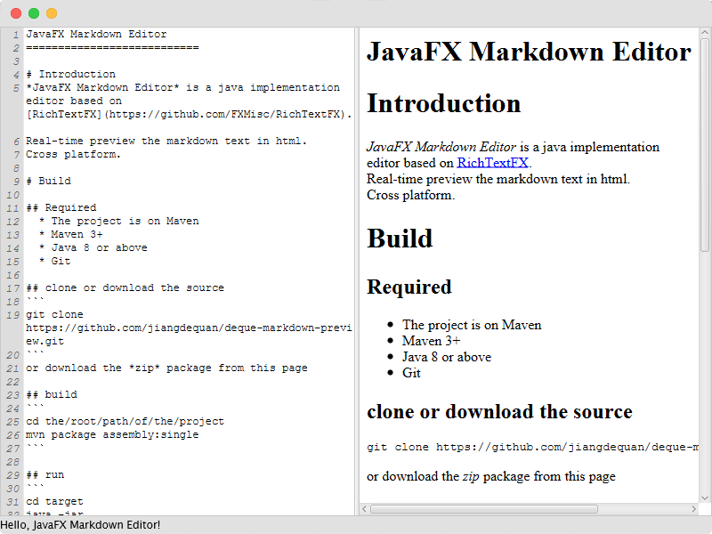

JavaFX Markdown Editor
===========================

# Introduction
*JavaFX Markdown Editor* is a java implementation editor based on [RichTextFX](https://github.com/FXMisc/RichTextFX).  
Real-time preview the markdown text in html.  
Cross platform.

# Build

## Required
  * The project is on Maven
  * Maven 3+
  * Java 8 or above
  * Git

## clone or download the source
```
git clone https://github.com/jiangdequan/deque-markdown-preview.git
```
or download the *zip* package from this page

## build
```
cd the/root/path/of/the/project
mvn package assembly:single
```

## run
```
cd target
java -jar deque-markdown-editor-****-jar-with-dependencies.jar
```
or double click the executable _jar_ file

**If you just want to use this, you must have the java environment in your computer. You can execute the command below to check about it.**  

```
java -version
```

the output should like this:
```
java version "1.8.0_144"
Java(TM) SE Runtime Environment (build 1.8.0_144-b01)
Java HotSpot(TM) 64-Bit Server VM (build 25.144-b01, mixed mode)
```

# picture


# License
Dual-licensed under [BSD 2-Clause License](http://opensource.org/licenses/BSD-2-Clause) and [GPLv2 with the Classpath Exception](http://openjdk.java.net/legal/gplv2+ce.html).